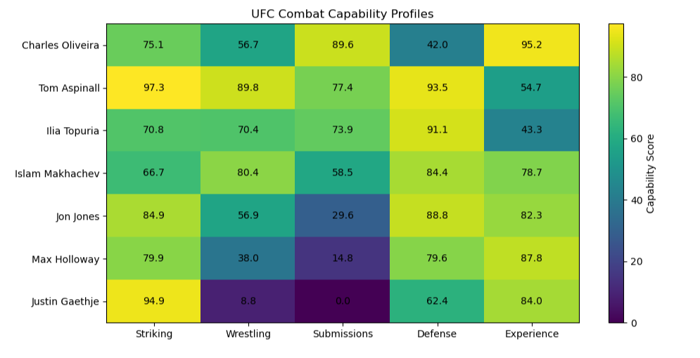
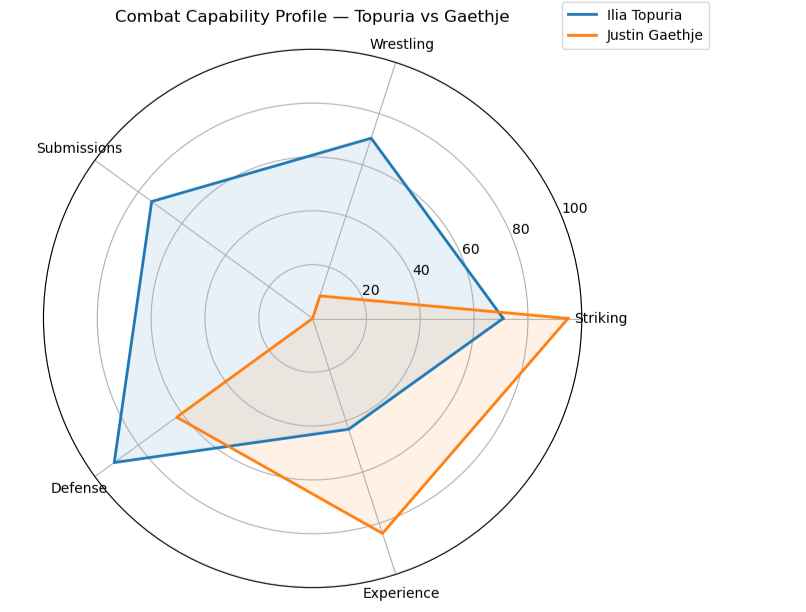

# UFC Combat Capability Analyzer

This project started with a fairly simple idea: use historical UFC fighter statistics to build profiles that could compare different areas of combat.

I originally thought of it as a **Combat Style Analyzer**, but while working with the data I realized that the available statistics describe a fighter's observed capabilities better than their actual fighting style. That distinction changed the direction of the project, so I ended up defining this first version as the **UFC Combat Capability Analyzer**.

The goal of V1 is not to predict fight winners or determine who is the "best" fighter. It is to build a descriptive and interpretable baseline that can later grow into style analysis, matchup analysis, and eventually fight prediction.

## What the model measures

Each fighter receives five scores from 0 to 100:

- **Striking**
- **Wrestling**
- **Submissions**
- **Defense**
- **Experience**

These scores represent relative positions within the dataset.

For example, a Striking score of 90 does not mean that a fighter has "90% striking ability." It means that, according to the metrics used in this version, the fighter ranks very high compared with the other fighters in the dataset.

Physical attributes such as reach, height, weight, and age were intentionally kept separate. I did not want to mix physical characteristics directly with technical capabilities, so they are left for a future module.

## Dataset

The project uses the **UFC Fighters' Statistics Dataset** published by asaniczka on Kaggle, based on data from UFCStats.

The dataset used in this analysis contains:

- **4,111 fighters**
- **18 variables**

The variables include professional records, striking statistics, takedowns, submissions, defense, and several physical attributes.

**Original dataset:**  
https://www.kaggle.com/datasets/asaniczka/ufc-fighters-statistics

**Dataset license:** ODC Attribution (ODC-By)

One important limitation is that the dataset does not contain the most recent UFC fights. Because of this, the project should be treated as an analysis of the available historical data rather than a current representation of the UFC roster.

## Data exploration and quality checks

Before building the scores, I explored the structure and quality of the dataset.

I checked:

- missing values;
- exact duplicates;
- repeated fighter names;
- fighters with zero recorded fights;
- distributions of the main statistics;
- extreme values and possible outliers;
- sample size by fighter;
- relationships between different metrics.

There were no exact duplicate rows.

A few fighter names appeared more than once, but after reviewing them I found that they corresponded to different people, so fighters were not automatically removed based on name alone.

Sample size also turned out to be important:

- 19 fighters have 0 recorded fights;
- 94 have only 1 fight;
- 177 have 2 or fewer;
- 434 have 5 or fewer.

This became relevant later when interpreting unusually high scores.

## Normalization

One of the main methodological decisions was how to compare statistics with very different scales and distributions.

I initially tested **Min-Max Scaling**. However, several variables contain extreme observations, which caused most fighters to become compressed into a relatively small part of the normalized scale.

This was particularly noticeable in metrics such as takedowns landed per 15 minutes.

Because the purpose of the model is mainly to compare fighters relative to the dataset, I decided to use **percentile ranks** instead.

I also adjusted the percentile transformation so that exact zeros remain zero.

This matters especially for Wrestling and Submissions, where a large part of the dataset contains zero values. Without this adjustment, fighters with no recorded activity in a metric could still receive a positive percentile score simply because many other fighters also had zero.

## Capability scores

### Striking

The Striking score uses:

- Significant Strikes Landed per Minute
- Significant Striking Accuracy

V1 baseline:

`50% volume + 50% accuracy`

### Wrestling

The Wrestling score uses:

- Average Takedowns Landed per 15 Minutes
- Takedown Accuracy

V1 baseline:

`50% volume + 50% accuracy`

### Submissions

The Submissions score currently uses:

- Average Submission Attempts per 15 Minutes

This is one of the clearest areas for future improvement. Submission attempts alone cannot represent every part of submission grappling ability.

### Defense

The Defense score combines:

- Significant Strike Defence
- Takedown Defense

V1 baseline:

`50% striking defense + 50% takedown defense`

### Experience

Experience uses information about career length and historical results.

To avoid treating draws exactly like losses, I calculated an **Adjusted Win Rate**:

`Adjusted Win Rate = (Wins + 0.5 × Draws) / Total Fights`

This is still a basic approximation of experience because the dataset does not provide a direct measure of opponent quality.

## Sample reliability

One concern during the analysis was that fighters with very small samples could obtain extreme statistics from only a few fights.

To keep track of this, fighters were classified into four sample reliability categories:

- **Very Low**
- **Low**
- **Moderate**
- **High**

I then checked whether fighters with Low or Very Low reliability were disproportionately represented among the top 10% of each capability score.

Across the complete dataset, approximately **28.3%** of fighters belong to the Low or Very Low categories.

Among the highest scores:

| Score | Low / Very Low in top 10% |
|---|---:|
| Striking | 29.4% |
| Wrestling | 30.8% |
| Submissions | 24.0% |
| Defense | 17.3% |

There was no clear general overrepresentation of small samples among the highest scores.

Because of this, I decided not to introduce an arbitrary shrinkage adjustment in V1. Sample reliability is kept as additional information for interpretation instead.

## Weight sensitivity

The 50/50 weights are baseline choices, not optimized parameters.

To test how dependent the rankings were on these choices, I compared the original 50/50 configuration with 60/40 and 40/60 alternatives using Spearman rank correlation.

| Score | 50/50 vs 60/40 | 50/50 vs 40/60 | 60/40 vs 40/60 |
|---|---:|---:|---:|
| Striking | 0.994 | 0.994 | 0.976 |
| Wrestling | 0.998 | 0.998 | 0.991 |
| Defense | 0.990 | 0.993 | 0.968 |

The rankings remained very similar under moderate changes in the weights.

This does not prove that 50/50 is the optimal weighting. It only shows that the main rankings in V1 are not highly sensitive to small changes in those assumptions.

## Some findings

The distributions of the combat metrics are quite different from each other.

Striking statistics are relatively continuous, while Wrestling and especially Submissions contain many zeros.

In fact, **2,321 fighters (56.46%)** have zero recorded submission attempts per 15 minutes.

Some relationships between metrics were also noticeable:

- striking volume vs. striking accuracy: **r ≈ 0.63**
- takedown volume vs. takedown accuracy: **r ≈ 0.59**
- striking defense vs. takedown defense: **r ≈ 0.53**

Individual fighter profiles also provided useful sanity checks.

Justin Gaethje, for example, produces a very polarized profile with particularly high Striking and Experience scores and much lower offensive grappling metrics.

Ilia Topuria has a more distributed profile across the five dimensions.

These comparisons are not fight predictions. They describe fighter profiles based on the variables available in this dataset.

## Combat capability profiles

The heatmap below shows the five capability scores for a small group of fighters. It gives a quick view of how different fighters can arrive at very different profiles even when all of them are evaluated using the same scoring system.



The purpose of this visualization is not to rank these fighters overall, but to make the structure of their profiles easier to compare.

## Fighter comparison: Ilia Topuria vs Justin Gaethje

The radar chart below shows one example of how the capability scores can be used to compare two fighters.



In this dataset, Gaethje's profile is much more concentrated around Striking and Experience, while Topuria has a more distributed profile across several dimensions.

This does **not** mean that the model predicts Topuria to beat Gaethje, or vice versa. The chart compares their statistical capability profiles; it does not model the interaction between them in an actual fight.

## Visualizations

The notebook contains additional visualizations used throughout the analysis, including:

- distributions of the main combat statistics;
- total-fight distributions;
- outlier exploration;
- scatter plots;
- correlation analysis and heatmap;
- fighter capability heatmap;
- radar chart comparison.

The visualizations were not only created for presentation. They were also useful during the analysis for identifying distribution problems, extreme observations, and differences between normalization methods.

## Limitations

There are several limitations to this first version:

- The dataset is not fully up to date.
- Scores are relative to this dataset and are not absolute percentages of skill.
- **Capability is not the same thing as fighting style.**
- Opponent quality is not included.
- Extreme statistics can still come from fighters with small samples.
- Wrestling and Submissions contain a large number of zeros.
- The 50/50 weights are baseline assumptions rather than optimized parameters.
- The Submissions score depends on only one available metric.
- Physical attributes are not incorporated into the capability scores.
- The model does not use fight-level data.
- The model does not account for interactions between two fighters.

For these reasons, the Combat Capability Analyzer should be understood as a **descriptive and exploratory tool**, not as a system for automatically deciding who is the better fighter or who would win a fight.

## Future work

V1 is intended as a baseline rather than a finished model.

Some directions I would like to explore next are:

1. update the dataset and eventually automate data collection;
2. incorporate opponent quality;
3. build a separate Physical Attributes module;
4. improve the representation of grappling and submissions;
5. explore statistical adjustments for small samples;
6. use fight-level data to separate capability from actual fighting style;
7. build a Matchup Analysis layer;
8. eventually explore Fight Prediction using historical data and out-of-sample validation.

The idea is not to replace this first version, but to build additional layers on top of a baseline that can already be inspected, interpreted, and questioned.

## Repository structure

```text
UFC-Combat-Capability-Analyzer/
│
├── data/
│   └── ufc-fighters-statistics.csv
│
├── images/
│   ├── capability_profiles_heatmap.png
│   └── topuria_vs_gaethje_radar.png
│
├── UFC_Combat_Capability_Analyzer.ipynb
└── README.md
```

## How to run the project

The analysis is contained in the Jupyter Notebook:

`UFC_Combat_Capability_Analyzer.ipynb`

The dataset is stored inside the `data` directory and is loaded using a relative path:

```python
df = pd.read_csv("data/ufc-fighters-statistics.csv")
```

To reproduce the analysis:

1. Download or clone the repository.
2. Keep the repository structure unchanged.
3. Open `UFC_Combat_Capability_Analyzer.ipynb` in Jupyter Notebook or JupyterLab.
4. Run the notebook from top to bottom.

The notebook was tested by restarting the kernel and running all cells from a clean state.

## Tools used

- Python
- pandas
- NumPy
- Matplotlib
- Jupyter Notebook

## Final note

This is the first complete version of the project, but it is also part of my process of learning how to apply data analysis to combat sports.

One of the most useful parts of building it was not just creating the scores. It was having to decide what the data actually supports, test some of those decisions, and recognize where the model stops being able to answer a question.

That is also why I kept the distinction between **capability, style, matchup, and prediction** throughout the project. They are related problems, but they are not the same problem.
